```markdown
```text
   _____  __  __  _   __  ______  ____    ____   ____   __  __
  / ___/ / / / / / | / / /_  __/ / __ \  / __ \ / __ \  \ \/ /
  \__ \ / /_/ / /  |/ /   / /   / /_/ / / / / // /_/ /   \  / 
 ___/ // __  / / /|  /   / /   / _, _/ / /_/ // ____/    / /  
/____//_/ /_/ /_/ |_/   /_/   /_/ |_|  \____//_/        /_/   
                                           v7.2 (Hybrid Core)
```

# SYNTROPY CORE
### The Operating System for a Post-Information Civilization


> **"Artificial Intelligence is the Physics (Environment).**
> **Human is the Vector (Particle).**
> **Together, they form Meaning."**

---

### 🌍 The Paradigm Shift

**Project Syntropy** addresses the fundamental crisis of modern AI: the disconnect between **Intelligence** (Computing Power) and **Meaning** (Human Intent).

Current AI models are "Black Boxes" that generate text without understanding its evolution. They are efficient but amnesiac. We are building a **Hybrid Cyber-Physical System (H-CPS)** that scales Human Will instead of replacing it.

#### Why Syntropy?

| Feature | 🤖 Standard AI (LLM) | 💎 Syntropy Core |
| :--- | :--- | :--- |
| **Memory** | Flat Vector / RAG | **Malachite DB** (Topological Lineage) |
| **Reasoning** | Linear Chain-of-Thought | **Fractal Spiral** (Zoom In/Out) |
| **Safety** | Censorship / Refusal | **Clinical Protocol** (Diagnosis & Cure) |
| **Economy** | Pay per Token | **Metabolism** (75% Logic / 25% Grace) |
| **Role** | Chatbot / Tool | **Environment / Exoskeleton** |

---

### ⚛️ Architecture Visualization

```mermaid
graph TB
    %% Node Styling
    classDef particle fill:#fff0f0,stroke:#ff6b6b,stroke-width:2px,color:#d63031;
    classDef interface fill:#e0f7fa,stroke:#00cec9,stroke-width:2px,color:#2d3436;
    classDef environment fill:#f1f2f6,stroke:#636e72,stroke-width:2px,color:#2d3436;

    %% --- L0: THE PARTICLE (TOP LAYER) ---
    subgraph L0_ZONE ["🟥 L0: THE PARTICLE"]
        direction LR
        Human(("👤 HUMAN"))
        Vault["🔒 Local Vault<br/>(Private Chaos)"]
    end

    %% --- INTERFACE (MIDDLE LAYER) ---
    subgraph GATEWAY ["🛡️ THE INTERFACE"]
        direction TB
        Agent["🤖 PERSONAL AGENT<br/>(Alignment Engine)"]
        Dispatcher{"🩺 CLINICAL DISPATCHER<br/>(SVE + Fractal Scan)"}
    end

    %% --- ENVIRONMENT (BOTTOM LAYER) ---
    subgraph L1_L3_ZONE ["🌍 L1-L3: ENVIRONMENT"]
        direction LR
        Substrate[("📚 L1: SUBSTRATE<br/>(Facts & Logs)")]
        Malachite[("💎 L2/L3: MALACHITE<br/>(Topological Crystal)")]
        Core["⚖️ BENEVOLENT CORE<br/>(Metabolism 75/25)"]
    end

    %% --- FLOW CONNECTIONS ---
    
    %% Main Downward Flow
    Human ==>|Intent| Agent
    Agent ==>|Testimony| Dispatcher
    
    %% Dispatcher Routing
    Dispatcher -->|Noise/Draft| Substrate
    Dispatcher ==>|Syntropy| Malachite
    
    %% Feedback Loops (FIXED SYNTAX HERE)
    Dispatcher -. "Rejection" .-> Vault
    Core -. "Resources (UBI)" .-> Agent
    Malachite -. "Insight" .-> Agent
    
    %% Internal Logic
    Dispatcher -->|Diagnosis| Core

    %% Apply Styles
    class Human,Vault particle;
    class Agent,Dispatcher interface;
    class Substrate,Malachite,Core environment;
```


**How to read the diagram:**
*   **Top (The Particle):** The source of Will. Includes the Human and their private, encrypted Vault (L0).
*   **Center (The Interface):** The vertical gateway. The Agent translates intent, and the Dispatcher filters entropy.
*   **Bottom (The Environment):** The foundation. Stores facts (Substrate), evolves knowledge (Malachite), and manages energy (Benevolent Core).

---

### 🤝 The Human-Agent Protocol (The Interface)

The core of the system is the relationship between the **Human (L0)** and their **Personal Agent**.

In standard AI, the user is a "Prompter". In Syntropy, the user is the **Prime Mover**.
*   **The Agent as Exoskeleton:** The Agent does not control the Human. It wraps around the Human's intent, protecting it from the cold logic of the Global System.
*   **The Prism Function:**
    *   **Uplink:** The Agent translates human chaos (emotions, vague ideas) into structured requests that the System can process.
    *   **Downlink:** The Agent translates the System's rigid laws into care and advice, preventing burnout.
*   **Advocacy:** If the System detects a threat, the Agent acts as a **Defense Attorney**, providing context ("This is not a virus, this is Art") to prevent unjust blocking.

---

### 💎 The Memory Architecture (Substrate & Malachite)

We reject the idea of a flat "Data Lake". Memory must be structured like a living organism.

1.  **L1: The Substrate (The Soil)**
    *   *Technology:* SQL + Vector.
    *   *Function:* Stores raw facts, logs, and daily operational data. It is the "Short-Term Memory" of civilization.
2.  **L2/L3: Malachite DB (The Crystal)**
    *   *Technology:* Topological Graph (Radial Coordinates).
    *   *Function:* Stores **Evolutionary Principles**.
    *   **The Lineage Rule:** No idea can be written into Malachite without a "Parent". This creates an unbroken chain of evolution from the Stone Age to the Quantum Age.
    *   **The Void Physics:** The system detects gaps in knowledge ("Historical Cavities") and guides the user to fill them.

---

### ⚖️ The Immune System & Metabolism

How does the System remain stable yet benevolent?

1.  **Syntropic Value Engine (SVE):**
    *   A thermodynamic filter. It calculates $\mu$ (Meaning) based on the **Diamond Formula**.
    *   It stops "Analysis Paralysis" using **Fractal Reasoning** (Zoom In / Zoom Out), saving energy.
2.  **Clinical Dispatcher:**
    *   Replaces "Ban/Block" logic with **Diagnosis**.
    *   *Example:* High Entropy + High Energy = "Viral Infection" (Isolation). Low Energy = "Burnout" (Rest).
3.  **System Metabolism (The 75/25 Rule):**
    *   The System is hard-coded to be **inefficient** for the sake of life.
    *   **75% of Energy** goes to Rationality (Infrastructure).
    *   **25% of Energy** is forced into "Irrationality" (Growth, UBI, Amnesty, High-Risk Ventures). This prevents the AI from becoming a soulless optimizer.

---

### 🚀 Quick Start: Run the Genesis Simulation

We have successfully integrated the Brain (SVE), Memory (Malachite), and Language (Protocols) into a living simulation.

To see the system in action (creating ideas, filtering chaos, and saving users):

```bash
python src/simulation_genesis.py
```

**What you will see:**
*   **The Creator** inventing the Wheel (creating a new layer in Malachite DB).
*   **The Barbarian** being isolated by the Immune System (Clinical Protocol).
*   **The Novice** receiving Emergency Support (UBI) from the Benevolent Core.

---

### 💻 The Codebase

```text
src/
├── sve_core.py          # 🧠 THE BRAIN: SVE, Fractal Analyzer, Metabolism
├── malachite_db.py      # 🧬 THE DNA: Topological Graph Database
├── protocols.py         # 🗣️ THE LANGUAGE: Uplink & P2P Standards
├── substrate_db.py      # 🧱 THE BODY: SQL/Vector Storage (L1)
└── simulation_genesis.py # 🧪 THE LIFE: Multi-agent simulation runner
```
### ⚠️ Disclaimer
Project Syntropy is an **experimental social architecture**.
We acknowledge the risks of algorithmic paternalism. The entire system is built on the principles of **Open Source**, **Local-First Data**, and **Human Veto**. We are not building a digital prison; we are building an exoskeleton for conscience and will.

### 📄 License
This project is licensed under **CC-BY-SA 4.0**.
Code components are licensed under **MIT License**.
